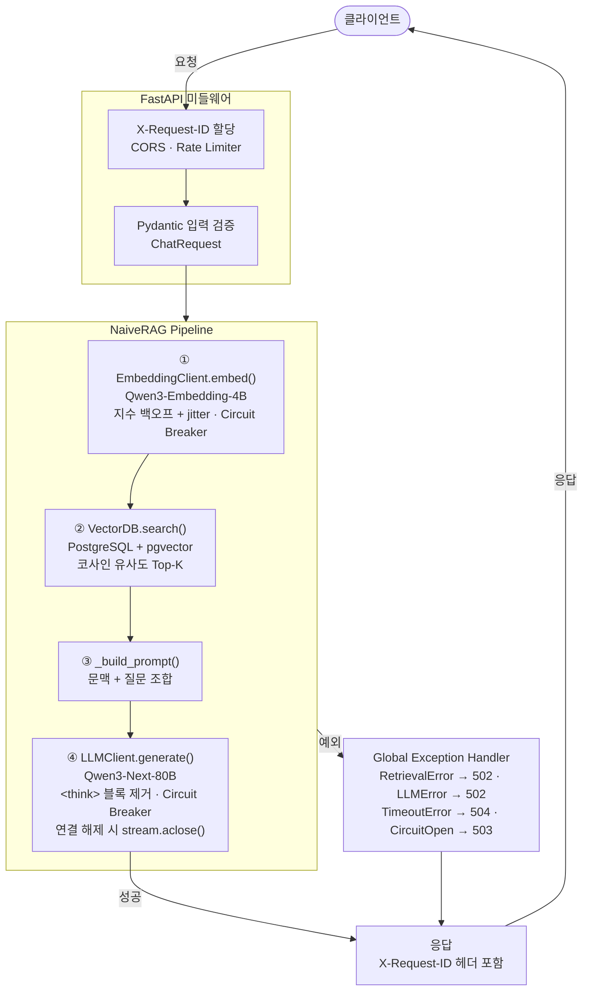
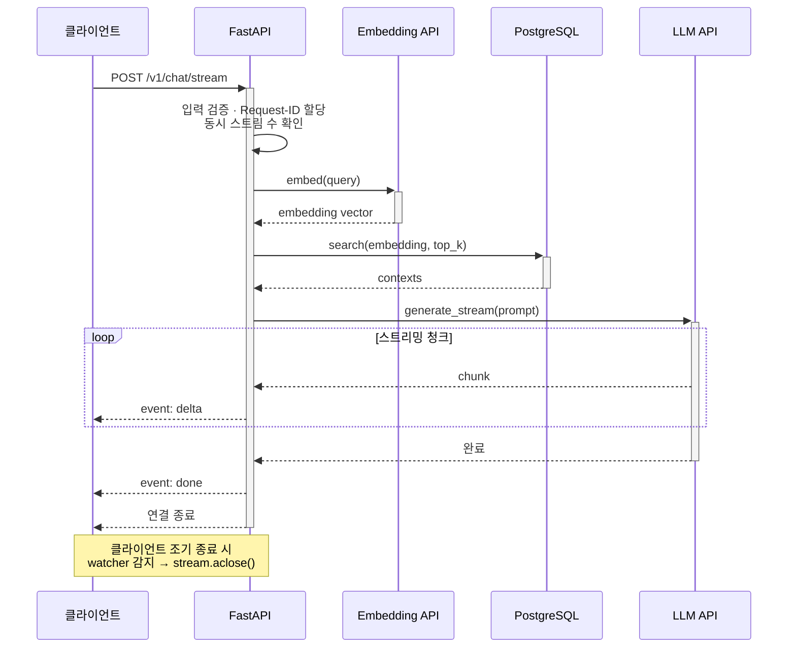
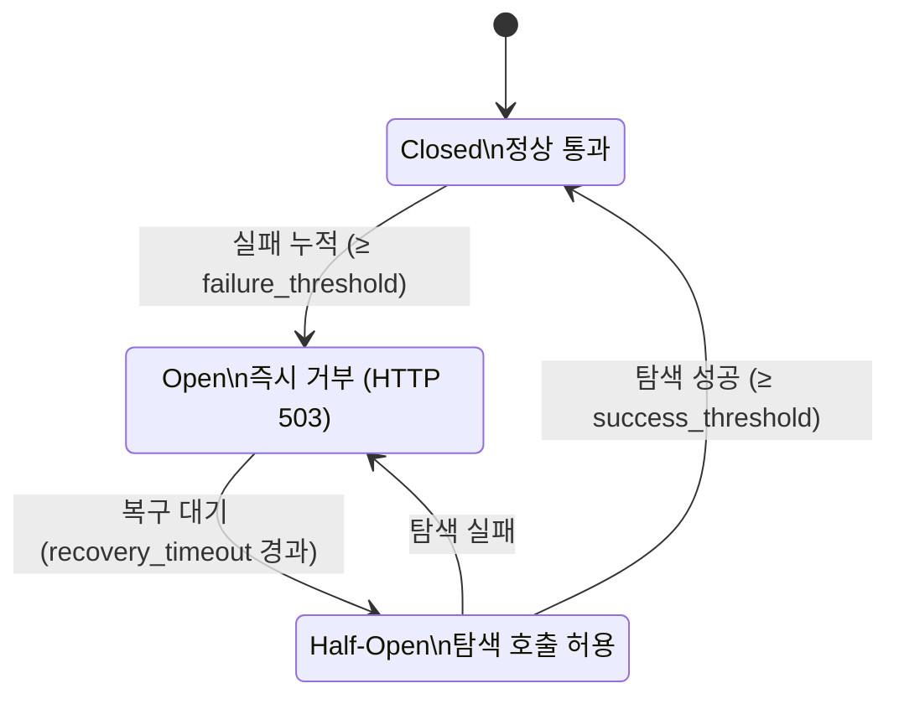

# RAG 기반 한국어 QA 챗봇


KorQuAD v1.0 데이터셋과 pgvector(PostgreSQL)를 사용한 NaiveRAG 챗봇 시스템입니다.

---

## 아키텍처 개요



---

## 프로젝트 구조

```
interX_rag_chatbot/
├── main.py                         # FastAPI 애플리케이션 (엔드포인트, 미들웨어, 예외 핸들러)
├── cli.py                          # CLI 인터페이스 (대화형)
├── entrypoint.sh                   # uvicorn 시작 스크립트 (tini 하위 프로세스)
├── Dockerfile                      # API 서버 이미지 (멀티스테이지, non-root, tini PID 1)
├── Dockerfile.build                # VectorDB 구축 전용 이미지
├── Dockerfile.build.dockerignore   # 빌드 이미지 전용 ignore
├── .dockerignore                   # API 이미지 전용 ignore
├── docker-compose.yml              # PostgreSQL + Redis + API 서버 구성
├── alembic.ini                     # Alembic 마이그레이션 설정
├── pytest.ini                      # pytest 설정 (asyncio_mode=auto)
├── requirements.txt                # 프로덕션 의존성 (pip-compile pinned)
├── requirements.in                 # 프로덕션 직접 의존성
├── requirements-build.txt          # 빌드 전용 의존성 (pinned)
├── requirements-build.in           # 빌드 직접 의존성
├── requirements-dev.txt            # 개발/테스트 의존성 (pinned)
├── requirements-dev.in             # 개발/테스트 직접 의존성
├── Makefile                        # lock/sync/migrate/test/up 등 표준 명령
├── .env                            # API 키 및 환경변수 (gitignore 대상)
├── .env.example                    # 환경변수 템플릿
├── alembic/
│   ├── env.py                      # Alembic 실행 환경 (asyncio + SQLAlchemy)
│   ├── script.py.mako              # 마이그레이션 파일 템플릿
│   └── versions/
│       └── 001_initial_schema.py   # 초기 스키마 (vector 익스텐션 + documents 테이블)
├── scripts/
│   ├── __init__.py
│   ├── embed_and_export.py         # KorQuAD 로딩 + 임베딩 생성 → parquet 저장 (1회 실행)
│   └── build_vectordb.py           # parquet → pgvector DB 적재 (임베딩 API 불필요)
├── data/
│   └── embeddings.parquet          # 사전 생성된 임베딩 데이터
├── tests/
│   ├── __init__.py
│   ├── conftest.py                 # pytest fixtures (mock_rag, AsyncClient)
│   ├── test_api.py                 # FastAPI 엔드포인트 통합 테스트
│   ├── test_circuit_breaker.py     # Circuit Breaker 상태 전이 단위 테스트
│   ├── test_llm.py                 # LLMClient 로직 단위 테스트 (_strip_thinking, _iter_stream 등)
│   ├── test_rag.py                 # RAG 파이프라인 로직 단위 테스트 (_build_prompt 등)
│   ├── test_retry.py               # retry 모듈 단위 테스트
│   └── integration/
│       ├── conftest.py             # 실 DB 연결 fixtures (function scope)
│       └── test_vectordb.py        # pgvector 통합 테스트
└── src/
    ├── config.py                   # 환경변수 설정 (Pydantic Settings)
    ├── circuit_breaker.py          # 3상태 서킷 브레이커 (인메모리 + Redis 분산)
    ├── vectordb.py                 # pgvector 연동 (asyncpg)
    ├── embeddings.py               # Embedding API 클라이언트 (CB + 재시도)
    ├── llm.py                      # LLM API 클라이언트 (CB + 재시도 + 스트리밍)
    ├── metrics.py                  # Prometheus 커스텀 메트릭
    ├── rag.py                      # NaiveRAG 파이프라인
    └── retry.py                    # 지수 백오프 + jitter 재시도 데코레이터
```

---

## 실행 방법

### Docker (권장)

#### 1. 환경변수 설정

```bash
# Linux / Git Bash
cp .env.example .env
```

```powershell
# PowerShell
Copy-Item .env.example .env
```

> `.env` 파일에서 반드시 아래 항목을 설정하세요.
> **필수**: `LLM_API_KEY`, `LLM_BASE_URL`, `EMBEDDING_API_KEY`, `EMBEDDING_BASE_URL`
> 이 값이 비어 있으면 서버 시작 시 즉시 오류가 발생합니다.
> 선택: `POSTGRES_PASSWORD` (기본값 변경 권장), `WORKERS`, `RATE_LIMIT`

#### 2. VectorDB 구축 (최초 1회)

사전 생성된 `data/embeddings.parquet`를 읽어 PostgreSQL에 적재합니다.
임베딩 API 호출 없이 동작하므로 빠르게 완료됩니다.

```bash
# Linux / Git Bash / PowerShell 공통
docker compose --profile build run --rm build-vectordb

# 또는 Makefile 사용 (Linux / Git Bash)
make build-vectordb
```

#### 3. API 서버 실행

```bash
# Linux / Git Bash / PowerShell 공통
docker compose up -d

# 컨테이너 상태 확인
docker compose ps

# 로그 확인
docker compose logs -f api
```

PostgreSQL + Redis + API 서버가 함께 시작됩니다. 서버는 `http://localhost:8000`에서 접근 가능합니다.

> **Docker 구성 참고**
> - `tini`가 PID 1을 담당하여 좀비 프로세스 회수 및 SIGTERM을 uvicorn에 안전하게 전달합니다.
> - 컨테이너 헬스체크는 curl 없이 Python 표준 라이브러리(`urllib`)로 수행합니다.
> - uvicorn은 `entrypoint.sh`를 통해 `exec`으로 실행되어 tini의 직접 자식이 됩니다.

> Dockerfile에 `HEALTHCHECK` 인스트럭션이 포함되어 있어 Docker 데몬이 30초마다 `/health` 엔드포인트를 자동으로 확인합니다. `docker compose ps`에서 `(healthy)` 상태를 확인할 수 있습니다.

#### 4. 동작 확인

```bash
# Linux / Git Bash
curl http://localhost:8000/health
curl http://localhost:8000/health/ready
curl -X POST http://localhost:8000/v1/chat \
  -H "Content-Type: application/json" \
  -d '{"query": "대한민국의 수도는 어디인가요?"}'
```

```powershell
# PowerShell — 헬스체크
Invoke-RestMethod http://localhost:8000/health
# status : healthy

Invoke-RestMethod http://localhost:8000/health/ready
# status    : healthy
# db        : ok
# embedding : ok
# llm       : ok

# PowerShell — 챗봇 질의 (Python 사용)
python -c "import requests; r = requests.post('http://localhost:8000/v1/chat', json={'query': '대한민국의 수도는 어디인가요?'}); print(r.json()['answer'])"
# 대한민국의 수도는 서울입니다.
```

#### 5. CLI 인터페이스 실행

```bash
docker exec -it rag_api python cli.py
```

> `quit`, `exit`, `q` 또는 `Ctrl+C`로 종료

---

### 로컬 실행

#### 1. 의존성 설치

```bash
pip install -r requirements.txt
```

#### 2. PostgreSQL 시작

```bash
docker compose up postgres -d
```

#### 3. DB 마이그레이션

```bash
make migrate
# 또는
alembic upgrade head
```

#### 4. VectorDB 구축

임베딩 생성과 DB 적재를 분리하여 실행합니다.

```bash
# 4-1. 임베딩 생성 → parquet 저장 (임베딩 API 필요, 1회만 실행)
python -m scripts.embed_and_export          # 전체
python -m scripts.embed_and_export --limit 1000  # 일부만

# 4-2. parquet → DB 적재 (임베딩 API 불필요)
python -m scripts.build_vectordb
```

#### 5. API 서버 실행

```bash
uvicorn main:app --host 0.0.0.0 --port 8000 --reload
```

#### 6. CLI 인터페이스 실행

```bash
python cli.py
```

> `quit`, `exit`, `q` 또는 `Ctrl+C`로 종료

---

## API 엔드포인트

### 헬스 체크

| 엔드포인트 | 설명 |
|-----------|------|
| `GET /health` | DB 연결 확인 (경량) |
| `GET /health/ready` | DB + Embedding API + LLM API 병렬 확인 |

```bash
curl http://localhost:8000/health
# {"status": "healthy"}

curl http://localhost:8000/health/ready
# {"status": "healthy", "db": "ok", "embedding": "ok", "llm": "ok"}
# 장애 시: HTTP 503, {"status": "degraded", "db": "ok", "embedding": "error", "llm": "ok"}
```

```powershell
# PowerShell
Invoke-RestMethod http://localhost:8000/health
Invoke-RestMethod http://localhost:8000/health/ready
```

### 챗봇 질의 (non-streaming)

```
POST /v1/chat
Content-Type: application/json

{"query": "대한민국의 수도는 어디인가요?"}
```

응답:
```json
{"answer": "대한민국의 수도는 서울입니다."}
```

```bash
# Linux / Git Bash
curl -X POST http://localhost:8000/v1/chat \
  -H "Content-Type: application/json" \
  -d '{"query": "대한민국의 수도는 어디인가요?"}'
```

```powershell
# PowerShell (Python 사용, 한글 출력 안정적)
python -c "import requests; r = requests.post('http://localhost:8000/v1/chat', json={'query': '대한민국의 수도는 어디인가요?'}); print(r.json()['answer'])"
```

### 챗봇 질의 (SSE 스트리밍)

```
POST /v1/chat/stream
Content-Type: application/json

{"query": "대한민국의 수도는 어디인가요?"}
```

SSE 이벤트 형식:
```
event: delta
data: {"delta": "대한민국의"}

event: delta
data: {"delta": " 수도는 서울입니다."}

event: done
data: [DONE]
```

오류 발생 시:
```
event: error
data: {"error": "...", "type": "retrieval|llm|timeout|circuit_open|unknown"}

event: done
data: [DONE]
```

**연결 해제 처리**: 클라이언트가 SSE 연결을 끊으면 `request.is_disconnected()` 감지 후 스트리밍을 중단합니다. uvicorn이 태스크를 강제 취소하는 경우(`asyncio.CancelledError`)도 명시적으로 처리하며, 두 경우 모두 `stream.aclose()`를 호출하여 LLM API 스트리밍 연결을 즉시 회수합니다.



클라이언트 측 이벤트 처리 (JavaScript):
```javascript
// EventSource는 GET 전용이므로, POST SSE는 fetch + ReadableStream으로 처리합니다.
const res = await fetch('/v1/chat/stream', {
    method: 'POST',
    headers: { 'Content-Type': 'application/json' },
    body: JSON.stringify({ query: '질문을 입력하세요.' }),
});
const reader = res.body.getReader();
const decoder = new TextDecoder();
let buf = '';
while (true) {
    const { value, done } = await reader.read();
    if (done) break;
    buf += decoder.decode(value, { stream: true });
    const lines = buf.split('\n');
    buf = lines.pop();          // 마지막 불완전 행은 버퍼에 유지
    for (const line of lines) {
        if (line.startsWith('event: done')) break;
        if (line.startsWith('data: ') && !line.includes('[DONE]')) {
            const { delta } = JSON.parse(line.slice(6));
            process(delta);     // 청크 처리
        }
    }
}
```

```bash
# Linux / Git Bash (스트리밍 확인)
curl -X POST http://localhost:8000/v1/chat/stream \
  -H "Content-Type: application/json" \
  -d '{"query": "대한민국의 수도는 어디인가요?"}' \
  --no-buffer
```

```powershell
# PowerShell — 스트리밍 (Python 사용, 한글 출력 안정적)
python -c "
import requests
with requests.post('http://localhost:8000/v1/chat/stream', json={'query': '대한민국의 수도는 어디인가요?'}, stream=True) as r:
    for line in r.iter_lines():
        if line:
            print(line.decode('utf-8'))
"
```

### Prometheus 메트릭

```
GET /metrics
Authorization: Bearer <METRICS_TOKEN>  # METRICS_TOKEN 설정 시 필수
```

엔드포인트별 요청 수·레이턴시·진행 중 요청 수 + RAG 파이프라인 커스텀 메트릭 노출:

| 메트릭명 | 타입 | 설명 |
|---------|------|------|
| `rag_embedding_duration_seconds` | Histogram | 임베딩 API 소요 시간 |
| `rag_retrieval_duration_seconds` | Histogram | pgvector 검색 소요 시간 |
| `rag_llm_duration_seconds` | Histogram | LLM 답변 생성 소요 시간 |
| `rag_llm_ttfb_seconds` | Histogram | LLM 첫 청크 응답 시간 (TTFB) |
| `rag_retrieval_score` | Histogram | 벡터 검색 유사도 점수 (rank별) |
| `rag_context_chars_total` | Histogram | LLM에 전달된 문맥 총 글자 수 |

### API 문서 (Swagger UI)

기본 비활성화. `.env`에 `DOCS_ENABLED=True` 설정 후 접근:

```
http://localhost:8000/docs
http://localhost:8000/redoc
```

---

## 서킷 브레이커

외부 API(Embedding, LLM) 장애 시 연쇄 실패를 차단하는 3상태 서킷 브레이커가 적용됩니다.



| 상태 | 동작 |
|------|------|
| **Closed** | 정상 통과. 실패 누적 시 Open 전환 |
| **Open** | 즉시 `CircuitBreakerOpen` 예외 발생 (HTTP 503) |
| **Half-Open** | 탐색 호출 1회 허용. 성공 시 Closed, 실패 시 Open 복귀 |

- **인메모리 모드**: 단일 워커 개발 환경 (기본값, `asyncio.Lock` 사용)
- **Redis 분산 모드**: `REDIS_URL` 설정 시 멀티 워커 간 상태 공유. 상태 전이(`_check_state` / `_record_success` / `_record_failure`)는 Redis 분산 락(`SET NX PX` 기반)으로 TOCTOU 경쟁 상태를 방지합니다.
- **헬스체크 우회**: `/health/ready`의 `ping()` 호출은 서킷 브레이커를 거치지 않음 (장애 진단 독립성 보장)
- **스트리밍 전용 CB 처리**: 스트리밍 도중 중단 시 `_record_failure()` 명시 호출로 실패 카운트 정확히 누적

---

## 재시도 전략

임베딩 API와 LLM API 호출은 지수 백오프 + jitter 재시도를 적용합니다.

- **재시도 횟수**: 최대 3회 (설정 가능)
- **대기 시간**: `min(base × 2^attempt, max_delay) × Uniform(0.5, 1.0)` — max_delay 상한 적용 후 비례 jitter 적용 (50–100% 구간)
- **스트리밍 재연결**: mid-stream 단절 시 최대 2회 재연결 시도, 동일한 jitter 공식 적용
- **즉시 중단 조건**: `asyncio.TimeoutError` (외부 타임아웃은 재시도 불가), `non_retryable` 예외
- **Retry-After 헤더**: 서버가 헤더 반환 시 해당 대기 시간 준수

---

## 환경변수

| 변수명 | 설명 | 기본값 |
|--------|------|--------|
| `LLM_API_KEY` | LLM API 키 (**필수**, 미설정 시 서버 시작 실패) | - |
| `LLM_BASE_URL` | LLM API 엔드포인트 (**필수**, 미설정 시 서버 시작 실패) | - |
| `LLM_MODEL_NAME` | LLM 모델명 | Qwen/Qwen3-Next-80B-A3B-Instruct-FP8 |
| `LLM_TIMEOUT` | LLM API 타임아웃 (초) | 120.0 |
| `EMBEDDING_API_KEY` | Embedding API 키 (**필수**, 미설정 시 서버 시작 실패) | - |
| `EMBEDDING_BASE_URL` | Embedding API 엔드포인트 (**필수**, 미설정 시 서버 시작 실패) | - |
| `EMBEDDING_MODEL_NAME` | Embedding 모델명 | Qwen/Qwen3-Embedding-4B |
| `EMBEDDING_DIM` | 임베딩 벡터 차원 | 2560 |
| `EMBEDDING_TIMEOUT` | Embedding API 타임아웃 (초) | 30.0 |
| `POSTGRES_HOST` | PostgreSQL 호스트 | localhost |
| `POSTGRES_PORT` | PostgreSQL 포트 | 5432 |
| `POSTGRES_DB` | 데이터베이스명 | ragdb |
| `POSTGRES_USER` | 사용자명 | raguser |
| `POSTGRES_PASSWORD` | 비밀번호 | ragpassword |
| `REDIS_URL` | Redis URL (분산 CB/Rate Limiter, 미설정 시 인메모리) | - |
| `TOP_K` | 검색할 문맥 수 | 5 |
| `MAX_QUERY_LEN` | 최대 쿼리 길이 (글자) | 500 |
| `MAX_CONTEXT_CHARS` | LLM에 전달할 문맥당 최대 글자 수 | 2000 |
| `REQUEST_TIMEOUT` | 전체 요청 타임아웃 (초) | 180.0 |
| `DB_POOL_MIN_SIZE` | DB 커넥션 풀 최소 크기 | 2 |
| `DB_POOL_MAX_SIZE` | DB 커넥션 풀 최대 크기 | 10 |
| `HEALTH_DB_TIMEOUT` | DB 헬스체크 타임아웃 (초) | 5.0 |
| `HEALTH_EMBEDDING_TIMEOUT` | Embedding 헬스체크 타임아웃 (초) | 10.0 |
| `HEALTH_LLM_TIMEOUT` | LLM 헬스체크 타임아웃 (초) | 10.0 |
| `LOG_LEVEL` | 로그 레벨 (DEBUG/INFO/WARNING/ERROR) | INFO |
| `DOCS_ENABLED` | Swagger UI 활성화 여부 | False |
| `CORS_ORIGINS` | 허용 오리진 JSON 배열 (예: `["https://example.com"]`) | `["*"]` |
| `METRICS_TOKEN` | `/metrics` Bearer 토큰 (미설정 시 인증 없음) | - |
| `RATE_LIMIT` | IP당 요청 상한 (SlowAPI 형식) | 20/minute |
| `MAX_CONCURRENT_STREAMS` | 워커당 동시 SSE 스트리밍 상한 (총 상한 = 값 × WORKERS) | 50 |
| `WORKERS` | uvicorn 워커 수 (Docker) | 4 |

> `DB_POOL_MAX_SIZE × WORKERS ≤ PostgreSQL max_connections` 를 유지하세요.

---

## 로깅

모든 로그는 JSON 형식으로 출력됩니다 (ELK / Datadog / CloudWatch 호환).

```json
{
  "timestamp": "2025-01-01T00:00:00+00:00",
  "level": "INFO",
  "logger": "src.rag",
  "request_id": "550e8400-e29b-41d4-a716-446655440000",
  "message": "retrieve | embed=0.123s search=0.045s total=0.168s top_k=5"
}
```

- `request_id`: 모든 로그에 포함 (SSE 스트리밍 구간 포함)
- `X-Request-ID` 헤더: 클라이언트 제공 시 그대로 사용, 미제공 시 UUID 자동 생성

---

## 테스트

### 의존성 설치

```bash
pip install -r requirements-dev.txt
```

### 테스트 실행

```bash
# 전체 테스트
make test

# 상세 출력
make test-v

# 직접 실행
pytest
pytest -v
```

### 테스트 구성

| 파일 | 대상 | 테스트 수 |
|------|------|----------|
| `tests/test_api.py` | FastAPI 엔드포인트 · 에러 상태코드 · lifespan 검증 | 17개 |
| `tests/test_circuit_breaker.py` | CB 상태 전이 (CLOSED/OPEN/HALF_OPEN) | 7개 |
| `tests/test_llm.py` | `_strip_thinking` · `_iter_stream` · `_build_messages` | 12개 |
| `tests/test_rag.py` | `_build_prompt` 프롬프트 구조 | 4개 |
| `tests/test_retry.py` | 지수 백오프 · `Retry-After` · `max_delay` | 6개 |
| `tests/integration/test_vectordb.py` | pgvector 실 DB 통합 테스트 | 6개 |

**`test_api.py` 주요 케이스:**
- `POST /v1/chat` — 정상 응답, 빈 쿼리 422, 공백 쿼리 422, 필드 누락 422
- `POST /v1/chat` — `RetrievalError` → 502, `LLMError` → 502, `CircuitBreakerOpen` → 503, `TimeoutError` → 504
- `POST /v1/chat/stream` — SSE 정상 스트리밍 / `RetrievalError` · `LLMError` 발생 시 `event: error` + `event: done` 확인
- `GET /health` — DB 연결 확인
- `GET /health/ready` — 전체 서비스 정상 / Embedding 장애 시 503 degraded
- RAG 미초기화 상태 → 503 반환
- lifespan: `LLM_BASE_URL` / `EMBEDDING_BASE_URL` 미설정 시 `ValueError` 발생 확인

**`test_circuit_breaker.py` 주요 케이스:**
- CLOSED 상태에서 성공 호출 허용 / 성공 시 failure_count 리셋
- `failure_threshold` 도달 시 OPEN 전환
- OPEN 상태에서 모든 호출 차단 (실제 함수 미호출 확인)
- `recovery_timeout` 경과 후 HALF_OPEN 전환, 탐침 허용
- HALF_OPEN 탐침 실패 → OPEN 재전환
- `success_threshold` 연속 성공 → CLOSED 복구

**`test_llm.py` 주요 케이스:**
- `_strip_thinking`: 단일 블록 제거, 다중 블록 제거, 멀티라인 블록, 일반 텍스트 보존
- `_build_messages`: 시스템 프롬프트·히스토리·없음 각 조합
- `_iter_stream`: 정상 텍스트 통과, `<think>` 블록 제거, 청크 경계 분할 처리, `None` delta 무시

**`test_rag.py` 주요 케이스:**
- `_build_prompt`: 질문·문맥 포함 여부, 각 문맥 번호 부여(`[문맥 1]`, `[문맥 2]` ...) 확인
- 문맥 1개 / 빈 리스트 경계 케이스

**`test_retry.py` 주요 케이스:**
- 첫 시도 성공 / 1회 실패 후 재시도 성공
- 재시도 소진 시 원본 예외 raise (traceback 보존)
- `non_retryable` 예외 즉시 raise
- `Retry-After` 헤더 대기 시간 준수
- `max_delay` 상한 적용

---

## 의존성 관리 (pip-tools)

```bash
# pip-tools 설치
pip install pip-tools

# lock file 재생성 (의존성 추가/변경 시)
make lock        # requirements.txt 재생성
make lock-build  # requirements-build.txt 재생성
make lock-dev    # requirements-dev.txt 재생성

# 환경 동기화
make sync        # 프로덕션
make sync-dev    # 개발
```

`.in` 파일에 직접 의존성을 명시하고 `pip-compile`로 전체 의존성 트리를 버전 고정합니다.

| 파일 | 용도 |
|------|------|
| `requirements.in` / `.txt` | API 서버 프로덕션 실행 |
| `requirements-build.in` / `.txt` | VectorDB 구축 (datasets, alembic 포함) |
| `requirements-dev.txt` | 로컬 개발 및 테스트 (pytest, httpx 포함) |

---

## DB 마이그레이션 (Alembic)

스키마 변경 이력을 Alembic으로 관리합니다. `build_vectordb.py` 실행 시 `alembic upgrade head`가 자동 선행 실행됩니다.

```bash
# 마이그레이션 적용
make migrate

# 마이그레이션 이력 조회
make migrate-history

# 새 마이그레이션 파일 생성
alembic revision -m "add_new_column"

# 특정 리비전으로 롤백
alembic downgrade -1
```

| 리비전 | 설명 |
|--------|------|
| `001` | `vector` 익스텐션 활성화 + `documents` 테이블 생성 |

> `alembic/env.py`는 `src.config`에서 DB 접속 정보를 읽어 SQLAlchemy asyncio 엔진으로 마이그레이션을 실행합니다. 별도 URL 하드코딩 없이 `.env` 설정만으로 동작합니다.

> **`EMBEDDING_DIM`과 스키마 동기화**: `001` 마이그레이션은 `documents.embedding` 컬럼 차원을 `.env`의 `EMBEDDING_DIM` 값으로 동적으로 생성합니다. 차원을 변경할 경우 기존 마이그레이션을 재실행하는 것이 아니라 새 마이그레이션 파일(`alembic revision -m "change_embedding_dim"`)을 생성하세요.

---

## Makefile 주요 명령

```bash
make up              # Docker Compose로 서비스 시작
make down            # 서비스 중지
make build-vectordb  # VectorDB 구축 (Docker)
make logs            # API 서버 로그 실시간 출력
make migrate         # DB 마이그레이션 적용
make migrate-history # 마이그레이션 이력 조회
make test            # 유닛 테스트 실행
make test-v          # 유닛 테스트 (상세 출력)
make test-integration  # 통합 테스트 (실제 PostgreSQL 필요)
make test-all        # 유닛 + 통합 테스트 전체 실행
make lock            # requirements.txt 재생성
make lock-build      # requirements-build.txt 재생성
make lock-dev        # requirements-dev.txt 재생성
make lock-all        # lock file 전체 재생성
make sync            # 프로덕션 환경 의존성 동기화
make sync-build      # 빌드 환경 의존성 동기화
make sync-dev        # 개발 환경 의존성 동기화
```
